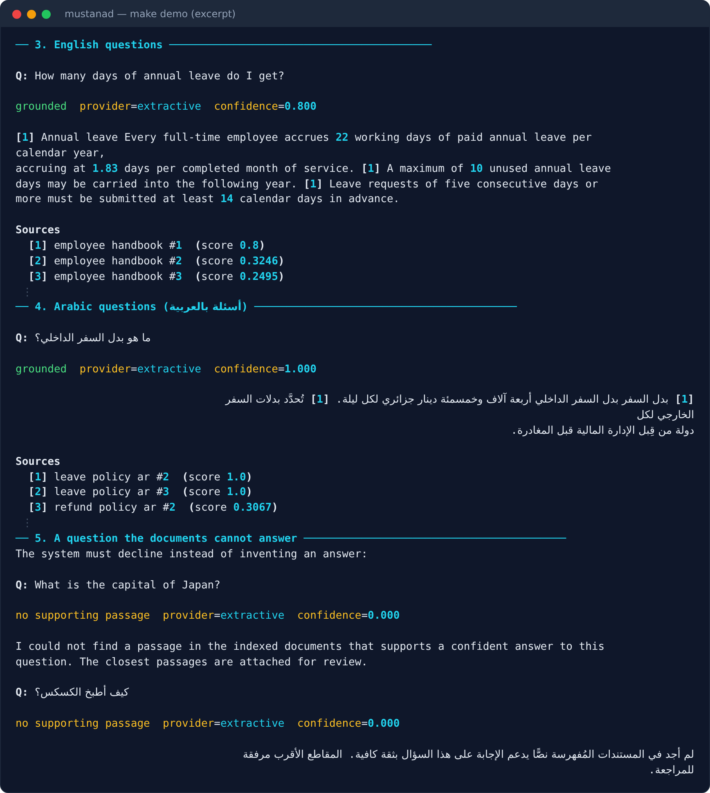
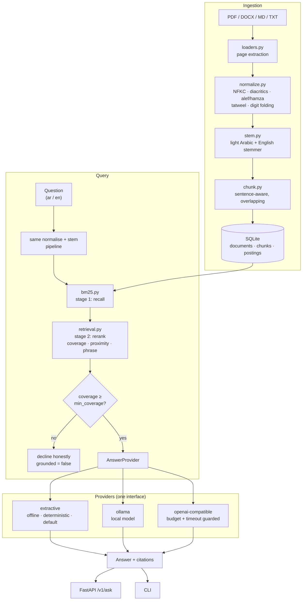

# mustanad · مُستَنَد

**Ask questions about your own documents and get answers with the passage each answer came
from — in Arabic or English, on your own machine, with no API key required.**

> Arabic *مُستَنَد* means "a document". *مُستَنِد* means "grounded in / supported by". Both
> readings are the product: answers that are grounded in a document you can check.

**[اقرأ بالعربية](README.ar.md)**

[](https://github.com/pgun879-alt/mustanad/actions/workflows/ci.yml)
[](https://www.python.org/)
[](#testing)
[](#testing)
[](LICENSE)



<sub>Real output of `make demo`, excerpted (`⋮` marks omitted lines). No API key, no network.</sub>

---

## The problem this solves

A clinic, a law office, a school, or a software team ends up with a few hundred pages of its
own prose — policies, manuals, SLAs, regulations — and staff answering the same questions out
of them every single day.

The two obvious fixes both fail:

- **Keyword search** returns *files*, not answers. Someone still has to read 14 pages.
- **Pasting the documents into a chatbot** returns confident text that may not be in the
  documents at all, with nothing to check it against — and for Arabic content it often
  misses the relevant passage entirely.

`mustanad` returns a short answer **plus the exact passage and source it came from**, and when
the documents do not contain the answer it says so instead of inventing one.

## What makes it different from a tutorial RAG script

| | Typical tutorial | `mustanad` |
|---|---|---|
| Works with no API key | No — needs a paid key to do anything | **Yes** — the default answerer is offline and deterministic |
| Arabic support | Breaks: no diacritic/alef/hamza folding, no stemming | Explicit, unit-tested normalisation **and** a light stemmer |
| Retrieval | `chroma` + `sentence-transformers` (~2.5 GB of `torch`) | **BM25 written from scratch**, persisted in SQLite, ~0 MB extra RAM |
| When it doesn't know | Answers anyway | Declines, and reports why |
| Prompt injection | Ignored | Document text is delimited and declared as data, not instructions |
| Quality claims | "It works!" | A labelled evaluation set in the test suite, **including its known failures** |

## Architecture



**Why the pipeline is shared.** Indexing and querying call the *same* `tokenize()`. If they
ever disagreed about normalisation or stemming, retrieval would silently return nothing and no
unit test on either side would notice.

**Why two retrieval stages.** BM25 is a bag of words: it cannot tell "the *annual* leave
*balance*" from a chunk mentioning "annual" in one paragraph and "balance" in another. Stage 1
pulls a cheap candidate pool from the index; stage 2 re-reads only those candidates and scores
term coverage, how tightly the matched terms cluster, and exact phrase presence. Token
positions are therefore never stored, which keeps the database small.

## Quickstart

```bash
git clone https://github.com/pgun879-alt/mustanad.git && cd mustanad
make setup
make demo
```

`make demo` needs **no API key, no network, and no model download**. It indexes the four
bundled bilingual sample documents and asks real questions in both languages, including two it
should refuse to answer.

Without `make`:

```bash
python3 -m venv .venv && ./.venv/bin/pip install -e '.[dev]' && ./scripts/demo.sh
```

## Usage

### CLI

```bash
export MUSTANAD_AUTH_REQUIRED=false

./.venv/bin/python -m mustanad.cli ingest samples
./.venv/bin/python -m mustanad.cli ingest /path/to/handbook.pdf --title "Employee Handbook"
./.venv/bin/python -m mustanad.cli list
./.venv/bin/python -m mustanad.cli ask "How many days of annual leave do I get?"
./.venv/bin/python -m mustanad.cli ask "ما مدة الضمان على الأجهزة الإلكترونية؟"
./.venv/bin/python -m mustanad.cli config     # effective settings, secrets redacted
./.venv/bin/python -m mustanad.cli delete 3
```

### HTTP API

```bash
export MUSTANAD_API_KEYS="$(python3 -c 'import secrets; print(secrets.token_urlsafe(32))')"
./.venv/bin/python -m mustanad.cli serve
```

Then `http://127.0.0.1:8000` is a minimal demo page and `http://127.0.0.1:8000/docs` is the
generated OpenAPI console.

| Method | Route | Purpose |
|---|---|---|
| `POST` | `/v1/ask` | Ask a question, get a cited answer |
| `POST` | `/v1/ingest/text` | Index a raw string |
| `POST` | `/v1/ingest/upload` | Index an uploaded file |
| `GET` | `/v1/documents` | List the corpus |
| `DELETE` | `/v1/documents/{id}` | Remove a document and its index entries |
| `GET` | `/healthz` · `/readyz` | Liveness · readiness (503 while the corpus is empty) |

```bash
curl -s -X POST http://127.0.0.1:8000/v1/ask \
  -H 'Content-Type: application/json' \
  -H "X-API-Key: $MUSTANAD_API_KEYS" \
  -d '{"question":"How many days of annual leave do I get?","top_k":3}'
```

```jsonc
{
  "question": "How many days of annual leave do I get?",
  "answer": "[1] Every full-time employee accrues 22 working days of paid annual leave …",
  "grounded": true,          // false => no passage supported an answer; the text says so
  "confidence": 0.8,         // rerank score of the best passage, 0..1
  "provider": "extractive",
  "citations": [
    { "index": 1, "document_title": "employee handbook", "page": null,
      "label": "employee handbook #1", "excerpt": "Annual leave …", "score": 0.8 }
  ],
  "warnings": []
}
```

`grounded` is the field that matters. `false` means the system refused to answer — the
`answer` string is an explicit "not found" message in the question's language, and the closest
passages are still attached for review.

## Configuration

Every setting is an environment variable prefixed `MUSTANAD_`, read from the environment or a
local `.env`. See [`.env.example`](.env.example) for the annotated full list. **Defaults work
offline**, so the only thing you must decide is authentication.

Configuration is validated at startup and refuses to run in a dangerous or incoherent state:

| Misconfiguration | Result |
|---|---|
| `AUTH_REQUIRED=true` with no `API_KEYS` | Startup fails — intending auth and silently getting none is the worst outcome |
| `PROVIDER=openai` with no `LLM_API_KEY` | Startup fails, and points at the free provider |
| `CHUNK_OVERLAP_TOKENS >= CHUNK_TOKENS` | Startup fails — chunking could not advance |
| `CANDIDATE_POOL < DEFAULT_TOP_K` | Startup fails — cannot return more results than were retrieved |

### Choosing a provider

| `MUSTANAD_PROVIDER` | Cost | Needs | What you get |
|---|---|---|---|
| `extractive` *(default)* | Free | Nothing | Quotes the sentences that best match your question, with citations. Deterministic. |
| `ollama` | Free | A local [Ollama](https://ollama.com) server and a pulled model | Fluent generated answers, fully private. A 3B-class quantised model is realistic on 8 GB RAM; 7B is not. |
| `openai` | **Paid** | An API key for any OpenAI-compatible endpoint | Best fluency. Guarded by a timeout, a context-size ceiling, and a daily call budget. |

Cost controls for the paid path are real and tested: `LLM_MAX_CONTEXT_CHARS` caps prompt size,
`LLM_DAILY_CALL_BUDGET=0` blocks all paid calls outright, and the provider refuses to spend
money when retrieval found no passages.

## Testing

```bash
make check      # ruff format --check + ruff check + mypy + pytest
make test
```

Verified on Python 3.13.9, Linux, by running these commands after the most recent change:

```
238 passed                                       # pytest
Success: no issues found in 20 source files      # mypy
All checks passed!                               # ruff check
37 files already formatted                       # ruff format --check
```

CI (`.github/workflows/ci.yml`) runs the same four checks in a clean container on every push, plus
a repository-hygiene scan that fails the build if a database, a virtual environment or a
credential-shaped literal is ever committed.

The suite runs fully offline. Remote providers are tested against an in-process `httpx`
mock transport, so request building, HTTP status handling and response parsing are all really
exercised without a network call or a key.

### Measured retrieval quality

`tests/test_retrieval.py` holds a labelled evaluation set that runs against the bundled corpus:
**16 of 17 answerable questions** (9 English, 7 Arabic) return the right document *and* the
expected fact in the answer, and all 3 unanswerable questions are correctly declined.

The one failure is listed in `KNOWN_FAILURES` with its cause, and a test asserts it *still
fails* — so if a future change fixes it, the suite breaks and forces the documentation to be
updated. See [Limitations](#limitations).

## Security

| Concern | How it is handled |
|---|---|
| Secrets | Never committed. `.env` and `data/` are git-ignored; `.env.example` holds placeholders only. `Settings` uses `repr=False` on key fields so a logged settings object cannot leak them. |
| API keys | Stored and compared as SHA-256 digests using `hmac.compare_digest`, over the whole allow-list, so neither content nor position leaks through timing. Fails closed: an empty allow-list rejects everything. |
| Rate limiting | Per-API-key sliding window (not a fixed window, which would allow `2 × limit` across a boundary). Returns 429 with `Retry-After`. |
| SQL injection | Every statement is parameterised. The only interpolation is a `?` placeholder run whose length comes from `len()` of an internal list. |
| Upload handling | Extension allow-list, byte-size cap enforced on a bounded read, and the server generates the temporary path itself — a crafted filename like `../../etc/passwd.md` is used only as a display title (test: `test_ingest_upload_cannot_be_used_to_traverse_the_filesystem`). |
| Untrusted archives | A DOCX is a ZIP, so the upload cap bounds only its *compressed* size: a 199 KiB file can declare 200 MiB of contents. The ZIP central directory is inspected and an implausible total size or compression ratio is refused **before anything is decompressed**. PDFs are capped at 2,000 pages so a small file cannot declare an enormous page tree. |
| Prompt injection | Retrieved passages are your documents, and a document can say anything. Passages are wrapped in explicit delimiters and the system instruction declares passage text to be data, never instructions. Citation markers pointing outside the supplied range are discarded as invented sources. |
| Log hygiene | Structured JSON logs carry ids, counts and timings — never document text. Upstream error bodies are truncated, because they can echo the prompt. |
| Deletion | `PRAGMA foreign_keys = ON` per connection, so deleting a document cascades to its chunks *and* postings. Orphaned postings would keep answering questions from content you believed was deleted (test: `test_delete_cascades_to_chunks_and_postings`). |
| Shell execution | None. No user or document input ever reaches a shell. |
| Default bind | `127.0.0.1`. Exposing the service on every interface must be a deliberate choice. |

**LLM honesty.** Model output is labelled as model output, the source passages always accompany
it, and nothing here treats a generated sentence as verified fact.

## Limitations

Stated plainly, because these are the things a buyer will hit.

1. **Broken (irregular) Arabic plurals do not match.** `يوم` and `أيام` are related by an
   internal vowel change, not a suffix, so a dictionary-free light stemmer cannot connect them.
   This costs one question in the evaluation set: the correct *document* is still retrieved,
   but the quoted sentence is wrong. Fixing it properly needs a broken-plural dictionary.
2. **The extractive provider selects and quotes; it does not synthesise.** It will not combine
   two passages into one narrative, resolve pronouns, or rewrite for fluency. For "how many
   days of leave?" the sentence *is* the answer; for "summarise our whole refund process",
   configure `ollama` or `openai`.
3. **No OCR.** Scanned image PDFs yield no text and are rejected with a message saying so. No
   OCR engine is bundled (`tesseract` is not a dependency).
4. **Lexical retrieval only by default.** A question sharing no vocabulary with the document
   will not match. The provider interface is where a semantic-embedding backend would plug in;
   it is deliberately not a default, because model weights are not viable on the 8 GB /
   integrated-graphics hardware this was built for.
5. **DOCX has no page numbers.** Without rendering, page boundaries are unknowable, so DOCX
   citations use a chunk ordinal (`Handbook #4`) rather than a page. PDFs cite real pages.
6. **Rate limiting and the call budget are per-process.** They reset on restart and are not
   shared between workers. That is honest for a single-server deployment and inadequate for a
   horizontally scaled one, which would need Redis.
7. **Single-tenant.** There is no per-user corpus isolation. Every API key sees every document.
8. **No reranking model.** Stage 2 is a hand-tuned weighted blend, not a learned cross-encoder.

## Troubleshooting

**`SettingsError: error parsing value for field "api_keys"`** — you are on a build from before
the `NoDecode` fix. Update; comma-separated values are parsed correctly now.

**Startup fails with "MUSTANAD_AUTH_REQUIRED is true but MUSTANAD_API_KEYS is empty"** —
working as intended. Either set keys, or set `MUSTANAD_AUTH_REQUIRED=false` for local use.

**`/readyz` returns 503 with `"empty-corpus"`** — nothing is indexed yet. Run
`mustanad ingest <path>`.

**An answer says "I could not find …" for something you know is in the documents** — in order:
(a) confirm the document indexed with `mustanad list`; (b) check it is not a scanned PDF
(limitation 3); (c) try the question using the document's own wording, since retrieval is
lexical; (d) lower `MUSTANAD_MIN_COVERAGE` (default `0.34`) if you would rather see weak
matches than a refusal.

**A scanned PDF is rejected** — expected. Run it through OCR first, then ingest the result.

**Ollama answers are very slow or the process is killed** — the model does not fit in RAM. Use
a smaller quantised model, or switch back to `extractive`.

**`make setup` fails with "externally-managed-environment"** — install into the virtual
environment, not system Python. `make setup` already does this; do not run `pip install`
outside `.venv`.

## Implementation status

Every row was verified by running the code, not by intending to.

| Feature | Status |
|---|---|
| PDF / DOCX / Markdown / text ingestion | ✅ Implemented and tested (PDF page numbers preserved) |
| Arabic normalisation (NFKC, diacritics, alef/hamza/teh-marbuta, tatweel, digits) | ✅ Implemented, 27 unit tests |
| Light Arabic + English stemmer | ✅ Implemented, idempotence asserted |
| BM25 index from scratch, persisted in SQLite | ✅ Implemented and tested |
| Two-stage retrieval with proximity rerank | ✅ Implemented and tested |
| Cited answers, bilingual | ✅ Verified over CLI and HTTP |
| Honest refusal when evidence is weak | ✅ Implemented and tested |
| Offline extractive provider | ✅ Default, deterministic |
| Ollama provider | ⚠️ Implemented and tested against a mock transport. **Not yet run against a real Ollama server** — no model was pulled on the development machine. |
| OpenAI-compatible provider | ⚠️ Implemented and tested against a mock transport. **Not yet run against the real paid API** — doing so costs money. |
| API-key auth, rate limiting, cost ceilings | ✅ Implemented and tested |
| Untrusted-archive guards: DOCX decompression-bomb refusal, PDF page cap | ✅ 3 tests; a 199 KiB archive declaring 200 MiB is refused before anything is expanded |
| CI (format, lint, types, tests, hygiene) | ✅ Workflow committed and valid. Its real status is the CI badge at the top of this file, which reports whatever GitHub last ran — including "no runs yet" |
| Labelled retrieval evaluation set | ✅ 16/17 answerable, 3/3 correctly declined |
| Semantic embeddings | ❌ Not implemented — the provider interface is the seam for it |
| OCR | ❌ Not implemented |
| Multi-tenancy | ❌ Not implemented |

The two ⚠️ rows are the honest boundary of what has been *executed*: the HTTP contract, error
mapping, budget enforcement and timeout handling are all covered by tests against a mock
transport, but no real remote model has been called from this code.

## Roadmap

1. Broken-plural dictionary for Arabic (closes the one known evaluation failure).
2. Optional embedding backend behind the existing interface, for semantic recall.
3. Per-tenant corpus isolation with scoped API keys.
4. Incremental re-ingestion on file change, instead of full re-index.
5. Redis-backed rate limiting and call budget, for multi-worker deployments.
6. Answer caching keyed on `(question, corpus version)`.

## Project layout

```
src/mustanad/
├── config.py          Settings, validated at startup
├── loaders.py         PDF / DOCX / MD / TXT -> pages
├── text/
│   ├── normalize.py   Arabic+English normalisation, tokenisation, sentence splitting
│   ├── stem.py        Light stemmer
│   └── chunk.py       Sentence-aware overlapping chunker
├── index/
│   ├── store.py       SQLite schema, documents/chunks/postings
│   └── bm25.py        BM25 scoring
├── retrieval.py       Two-stage retrieval and reranking
├── providers/         base (prompt policy) · extractive · remote (openai, ollama)
├── service.py         Orchestration shared by API and CLI
├── security.py        API-key verification, sliding-window rate limiter
├── api.py             FastAPI app
└── cli.py             Typer CLI
samples/               Bilingual sample corpus (fictional content)
tests/                 238 tests, including the labelled evaluation set
```

## Sample data

The four documents in `samples/` are **fictional content written for this demo** — a made-up
employee handbook, support SLA, Arabic leave policy, and Arabic refund policy. They describe no
real company and are not legal, HR, or financial advice.

## Contributing and security

- **[CONTRIBUTING.md](CONTRIBUTING.md)** — how to set the project up, the four gates every
  change has to pass, and the parts of this code that need care.
- **[SECURITY.md](SECURITY.md)** — the threat model, what counts as a vulnerability here, what
  deliberately does not, and how to report one privately.

## License

MIT — see [LICENSE](LICENSE).
